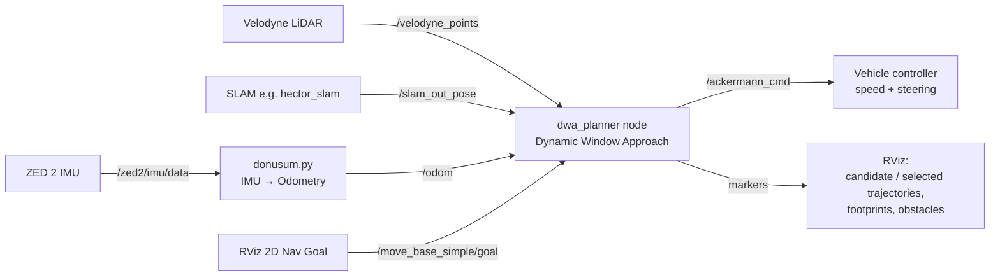

# DWA Local Planner for an Ackermann Autonomous Vehicle


This is a **Dynamic Window Approach (DWA)** local planner adapted from a differential-drive
research robot to a **real car-like (Ackermann-steered) autonomous vehicle**. The vehicle
sees obstacles with a **3D Velodyne LiDAR**, localizes with **SLAM** (`/slam_out_pose`) and
drives through **speed + steering-angle** commands (`ackermann_msgs/AckermannDrive`).

> The project is based on the open-source [`amslabtech/dwa_planner`](https://github.com/amslabtech/dwa_planner)
> ROS package (BSD-3-Clause). The original package targets differential-drive robots that use a
> 2D laser scan or an occupancy grid. This repository adds the changes needed to run it on a full-size
> Ackermann vehicle. The original README is kept at [`docs/UPSTREAM_README.md`](docs/UPSTREAM_README.md).


---

## ✨ What's new in this fork

| Area | Upstream `dwa_planner` | This project |
|---|---|---|
| **Vehicle model** | Differential drive (can rotate in place) | **Ackermann / car-like.** In-place rotation is disabled because a car cannot turn on the spot |
| **Control output** | `geometry_msgs/Twist` on `/cmd_vel` | **`ackermann_msgs/AckermannDrive` on `/ackermann_cmd`** (speed + steering angle) |
| **Perception input** | 2D `LaserScan` or `OccupancyGrid` local map | **3D Velodyne `PointCloud2`**, converted with PCL and filtered by height, range and FOV |
| **Localization** | TF only | Also subscribes to the **SLAM pose** (`/slam_out_pose`, e.g. hector_slam) |
| **Footprint** | Circle or footprint topic | **Rectangular vehicle footprint**, rotated along each predicted trajectory |
| **Odometry** | Wheel odometry | Helper node that builds `/odom` from the **ZED 2 IMU** |
| **Visualization** | Trajectories and footprints | Adds **obstacle markers** in RViz (`~obstacle_markers`) |
| **Tuning** | Small indoor robot | Retuned speed, yaw-rate, obstacle-cost and range values for the vehicle |

### Twist → Ackermann conversion

The DWA core still searches the velocity space `(v, ω)`. Each chosen command is turned into a
steering angle with the kinematic bicycle model:

$$
\delta = \arctan\left(\frac{L \cdot \omega}{v}\right), \qquad L = 0.865\ \text{m (wheelbase)}
$$

When the vehicle is stopped or driving straight (`v ≈ 0` or `ω ≈ 0`), the steering angle is set to `0`.

### Point-cloud obstacle extraction

Every `/velodyne_points` message is converted to `pcl::PointCloud<pcl::PointXYZ>`. A point becomes
an obstacle only if all of these hold:

- its height is `0.5 m ≤ z ≤ 10 m`, which removes the ground and the vehicle body
- its planar distance is `r ≤ 5 m`
- it lies inside the configurable horizontal field of view (360° by default)

The kept points are projected onto the 2D plane and used for the DWA obstacle cost.

---

## 🧭 System architecture



### How the planner works (one control cycle)

1. **Dynamic window:** compute the reachable `(v, ω)` set from the current speed and the acceleration limits.
2. **Trajectory rollout:** simulate each sample over `PREDICT_TIME` with the unicycle motion model.
3. **Cost evaluation:** score each trajectory as a weighted sum of
   - *to-goal cost*: distance from the trajectory end point to the goal
   - *obstacle cost*: clearance to the nearest LiDAR obstacle; any collision makes the trajectory invalid
   - *speed cost* and *path cost* (optional)
4. **Selection:** normalize the costs, pick the cheapest valid trajectory, convert it to an Ackermann command and publish it.

---

## 📦 Repository layout

```
dwa_planner/
├── config/
│   ├── dwa_param.yaml          # DWA / cost parameters
│   └── robot_param.yaml        # vehicle limits (velocity, yaw rate, accel)
├── include/dwa_planner/
│   └── dwa_planner.h           # DWAPlanner class (+ PointCloud / Ackermann additions)
├── launch/
│   ├── local_planner.launch    # main launch file
│   └── demo.launch             # upstream TurtleBot3 demo
├── src/
│   ├── dwa_planner.cpp         # ★ main planner: Velodyne + Ackermann version
│   ├── dwa_planner2d_lidar.cpp # variant that uses a 2D /scan instead of the Velodyne
│   ├── dwa_planner_node.cpp    # node entry point
│   ├── parameters.cpp          # parameter loading / defaults
│   ├── donusum.py              # ZED 2 IMU → /odom converter
│   ├── kontrol.py              # standalone /cmd_vel → /ackermann_cmd converter
│   ├── gorsellestirme.py       # matplotlib trajectory-prediction visualizer
│   ├── yedekle                 # backup of an earlier C++ iteration
│   └── denemeler/              # experiments: Python DWA prototypes, early Velodyne version
└── docs/                       # upstream documentation and images
```

---

## 🛠️ Requirements

- Ubuntu 20.04
- ROS Noetic
- PCL with `pcl_ros` and `pcl_conversions`
- `ackermann_msgs`
- Eigen3
- A SLAM node that publishes `geometry_msgs/PoseStamped` on `/slam_out_pose` (e.g. hector_slam)
- A Velodyne driver that publishes `/velodyne_points`

```bash
sudo apt install ros-noetic-pcl-ros ros-noetic-pcl-conversions ros-noetic-ackermann-msgs
```

## 🚀 Build

```bash
cd ~/catkin_ws/src
git clone https://github.com/ibrahimSutlu/dwa-ackermann-planner.git dwa_planner

cd ~/catkin_ws
rosdep install -riy --from-paths src --rosdistro noetic
catkin build dwa_planner -DCMAKE_BUILD_TYPE=Release   # or: catkin_make
source devel/setup.bash
```

## ▶️ Run

```bash
# 1. Sensors + SLAM (your own launch files)
roslaunch velodyne_pointcloud VLP16_points.launch
roslaunch hector_slam_launch tutorial.launch

# 2. Odometry from the ZED 2 IMU (optional, if you have no wheel odometry)
rosrun dwa_planner donusum.py

# 3. Local planner
roslaunch dwa_planner local_planner.launch

# 4. Send a goal from RViz with "2D Nav Goal", or:
rostopic pub /move_base_simple/goal geometry_msgs/PoseStamped \
  '{header: {frame_id: "map"}, pose: {position: {x: 5.0, y: 0.0}, orientation: {w: 1.0}}}'
```

To use a 2D laser scanner instead of the Velodyne, build `src/dwa_planner2d_lidar.cpp` in place of
`src/dwa_planner.cpp` (change the source in `CMakeLists.txt`).

---

## 📡 ROS interface

### Subscribed topics

| Topic | Type | Description |
|---|---|---|
| `/velodyne_points` | `sensor_msgs/PointCloud2` | 3D LiDAR point cloud (obstacle source) |
| `/slam_out_pose` | `geometry_msgs/PoseStamped` | Vehicle pose from SLAM |
| `/odom` | `nav_msgs/Odometry` | Current linear / angular velocity |
| `/move_base_simple/goal` | `geometry_msgs/PoseStamped` | Local goal |
| `/target_velocity` | `geometry_msgs/Twist` | Optional runtime cap on the target speed |
| `/dist_to_goal_th` | `std_msgs/Float64` | Optional goal tolerance at runtime |
| `/footprint`, `/path` | `PolygonStamped`, `Path` | Optional upstream inputs |

### Published topics

| Topic | Type | Description |
|---|---|---|
| `/ackermann_cmd` | `ackermann_msgs/AckermannDrive` | **Speed [m/s] + steering angle [rad]** |
| `~candidate_trajectories` | `visualization_msgs/MarkerArray` | All sampled trajectories (green = valid) |
| `~selected_trajectory` | `visualization_msgs/Marker` | Chosen trajectory |
| `~predict_footprints` | `visualization_msgs/MarkerArray` | Vehicle footprint along the chosen path |
| `~obstacle_markers` | `visualization_msgs/MarkerArray` | Obstacles taken from the point cloud |
| `~finish_flag` | `std_msgs/Bool` | `true` when the goal is reached |

### Key parameters (vehicle-tuned)

| Parameter | Value | Note |
|---|---|---|
| `MAX_VELOCITY` | 0.6 m/s | `robot_param.yaml` |
| `MAX_YAWRATE` | 0.6 rad/s | `robot_param.yaml` |
| `TARGET_VELOCITY` | 0.55 m/s | `dwa_param.yaml` |
| `PREDICT_TIME` | 3.0 s | rollout horizon |
| `VELOCITY_SAMPLES` / `YAWRATE_SAMPLES` | 3 / 20 | search resolution |
| Wheelbase `L` | 0.865 m | used for the steering-angle conversion |
| Obstacle height filter | 0.5 – 10 m | in `create_obs_list_from_cloud` |
| Obstacle max range | 5 m | in `create_obs_list_from_cloud` |

Full upstream parameter reference: [`docs/Parameters.md`](docs/Parameters.md).

---

## 🧪 Prototyping tools

- **`gorsellestirme.py`**: plots the predicted trajectory of the motion model for a given `(v, ω)`. Useful for choosing `PREDICT_TIME` and the yaw-rate limits.
- **`denemeler/dynamic_window_approach.py`**: a standalone Python DWA, based on PythonRobotics, with a rectangular vehicle model. It subscribes to `/slam_out_pose` and publishes `ackermann_cmd`. It was used to validate the method before the C++ integration.

## 🗺️ Roadmap

- [ ] Clear the obstacle list on every new point cloud, and publish the markers once per cloud instead of once per point
- [ ] Move the hard-coded values (wheelbase, footprint size, height/range/FOV filters) into ROS parameters
- [ ] Transform obstacles into a consistent frame (`velodyne` → `base_link`)
- [ ] Add a minimum turning radius / maximum steering angle constraint to the dynamic window
- [ ] Voxel-grid downsampling of the point cloud for better real-time performance

## 📚 References

- D. Fox, W. Burgard, S. Thrun, *"The Dynamic Window Approach to Collision Avoidance"*, IEEE Robotics & Automation Magazine, 1997.
- [amslabtech/dwa_planner](https://github.com/amslabtech/dwa_planner): the base ROS implementation
- [AtsushiSakai/PythonRobotics](https://github.com/AtsushiSakai/PythonRobotics): Python DWA reference used for prototyping

## 📄 License

BSD 3-Clause, inherited from the upstream project. See [LICENSE](LICENSE).
Original work © 2020 amsl. Modifications for the Ackermann vehicle integration © 2025 ibrahimSutlu.
